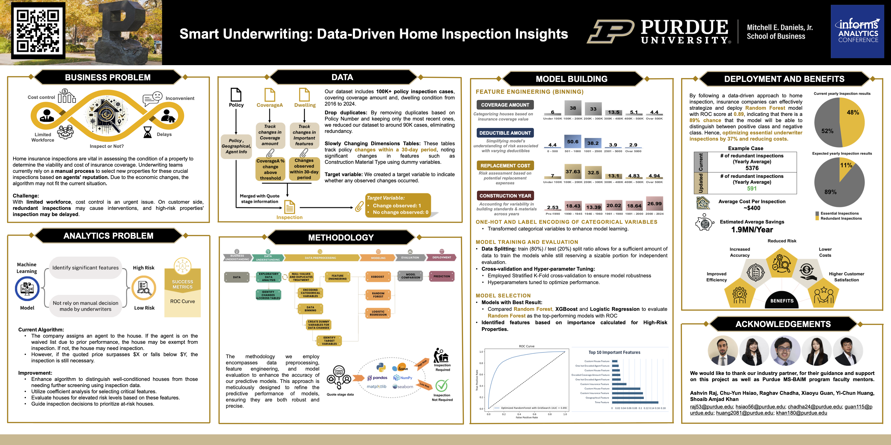

## Smart underwriting: Data-driven house inspection insight

### Background
The insurance industry is undergoing rapid transformation, driven by the integration of data analytics and machine learning. As highlighted by Gartner, WSJ, and Forbes, predictive analytics is reshaping risk assessment practices, driving customer-centric approaches, and streamlining operations across the insurance landscape. In the property insurance sector, the need for innovative data-driven solutions is critical.

This project, conducted in partnership with a major insurance company, seeks to optimize its home insurance inspection process. With evolving economic conditions and inflationary pressures, the company's current inspection algorithm requires enhancement to accurately reflect the changing landscape. The overarching goal is to develop an improved algorithm that effectively prioritizes home inspections, leading to better resource management and optimized underwriting decisions.

### Key questions
1.	How does the current inspection algorithm perform, and what areas require improvement?
2.	What are the critical factors contributing to the need for home inspections, and how can these be leveraged to create a more accurate predictive model?
3.	What proactive measures can be employed to identify high-risk properties?

Addressing these questions offers direct benefits to the insurance company. A more refined inspection process translates to improved risk management, accurate premium pricing, optimized resource allocation, and ultimately, increased customer satisfaction and profitability.

### Methodology

### Model comparsion
