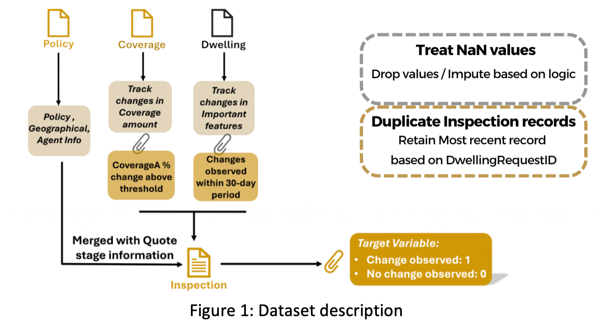
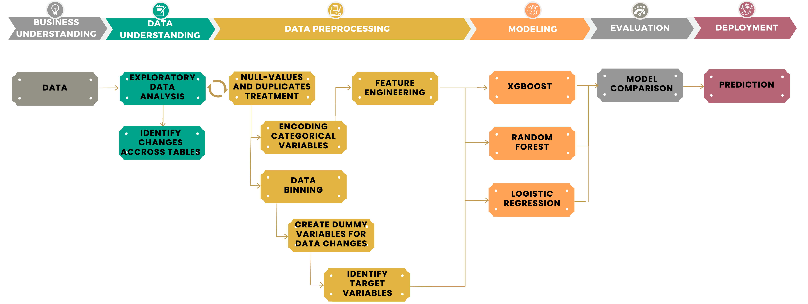
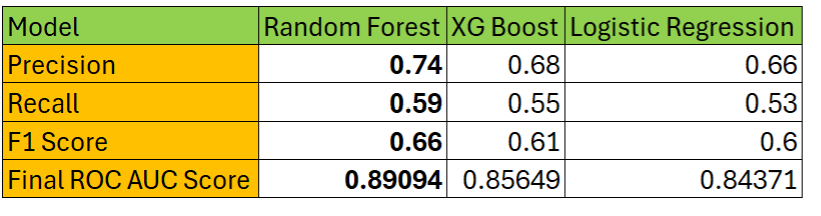

## Smart underwriting: Data-driven house inspection insight

### Background
The insurance industry is undergoing rapid transformation, driven by the integration of data analytics and machine learning. As highlighted by Gartner, WSJ, and Forbes, predictive analytics is reshaping risk assessment practices, driving customer-centric approaches, and streamlining operations across the insurance landscape. In the property insurance sector, the need for innovative data-driven solutions is critical.

This project, conducted in partnership with a major insurance company, seeks to optimize its home insurance inspection process. With evolving economic conditions and inflationary pressures, the company's current inspection algorithm requires enhancement to accurately reflect the changing landscape. The overarching goal is to develop an improved algorithm that effectively prioritizes home inspections, leading to better resource management and optimized underwriting decisions.

### Key questions
1.	How does the current inspection algorithm perform, and what areas require improvement?
2.	What are the critical factors contributing to the need for home inspections, and how can these be leveraged to create a more accurate predictive model?
3.	What proactive measures can be employed to identify high-risk properties?

Addressing these questions offers direct benefits to the insurance company. A more refined inspection process translates to improved risk management, accurate premium pricing, optimized resource allocation, and ultimately, increased customer satisfaction and profitability.

### Data discription

The primary data sources utilized in our analysis were:
- **CoverageA_SCD2**: A slowly changing dimensions (SCD) table tracking historical changes in policy coverage details. This table captured snapshots of coverage information over time, enabling us to analyze policy coverage evolution and identify potential trends or anomalies.
- **Dwelling_SCD2**: Another SCD table, designed to maintain a comprehensive record of changes in residential property attributes. By monitoring alterations to dwelling characteristics, such as renovations or additions, we could assess their potential impact on risk profiles and pricing strategies.
- **Policy**: A centralized repository containing core policy-related information, including policy numbers, effective dates, and associated customer details. This table served as a crucial link for integrating data from various sources.
- **Quote Stage Home Inspection Data**: Acting as our base table, this dataset comprised detailed inspection data collected by sales agents during the initial quotation stage. These records provided valuable insights into the condition of properties, enabling us to evaluate potential risks and tailor our analysis accordingly.

- **Linking Data Tables**: To effectively leverage the information contained within these disparate data sources, we developed a robust methodology to link the tables using unique policy numbers as the common key. This integration process was crucial for combining and comparing data across different sources, enabling a comprehensive view of each policy's lifecycle and associated risk factors.
- **Data Preprocessing**: During the data preparation phase, we encountered several challenges, including missing values in critical columns. We conducted thorough investigations to understand the underlying reasons for these data gaps and employed appropriate imputation techniques to fill in missing values with statistically sound estimates. This ensured the integrity and accuracy of our analysis, minimizing the impact of incomplete or inconsistent data.
  
A significant hurdle was keeping track of updates in the inspection data and the Slowly Changing Dimensions (SCD) tables. These tables captured historical changes, necessitating careful attention to policy numbers and the corresponding dates when changes were recorded. We implemented robust data management processes to ensure no important updates were overlooked, maintaining a comprehensive view of each policy's evolution over time.

In summary, our approach was methodical and thorough, combining meticulous data integration, quality assurance, and temporal analysis. By identifying and leveraging key data sources, addressing data quality issues, and paying close attention to changes over time, we were able to effectively link related data and extract valuable insights. This systematic process not only addressed the specific analytical needs of our project but also demonstrated the broader value of detailed and rigorous data analysis in enhancing decision-making processes within the insurance industry.

### Methodology

### Model comparsion
We evaluated the model's performance with multiple metrics: **confusion matrix**, **ROC-AUC score**, **precision**, **recall**, and **F1 score**. These metrics collectively provide a comprehensive evaluation of the model's performance, emphasizing its accuracy in class prediction and its ability to balance sensitivity and specificity. The table below presents a summary of the performance metrics for each model:

The **Random Forest** model demonstrated superior performance across all metrics, achieving a precision of 0.74, recall of 0.59, an F1 Score of 0.66, and the highest ROC AUC score of 0.89094. This indicates its robustness and reliability, making it suitable for scenarios that demand high accuracy and the ability to correctly identify both positive and negative classes.

**XG Boost**, while slightly trailing behind, showed commendable performance with a precision of 0.68, recall of 0.55, and an F1 Score of 0.61, accompanied by a ROC AUC score of 0.85649. Its results suggest it is a strong candidate for situations where the balance between detecting positives and minimizing false positives is critical. Meanwhile, **Logistic Regression** offered competitive yet slightly lower metrics with a precision of 0.66, recall of 0.53, an F1 Score of 0.60, and a ROC AUC score of 0.84371. The simplicity and interpretability of Logistic Regression make it ideal for use cases where understanding the model’s decision-making process is crucial.

